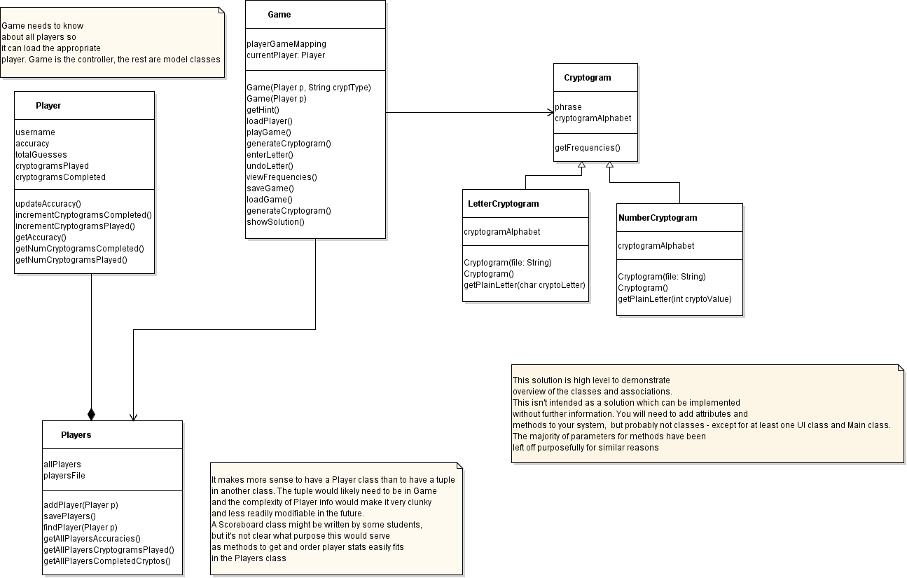

# Iteration 1

After class diagrams have been submitted, a sample solution will be released. This **must be used as the basis** for your implementation. All .java files, including
junit java files, for each iteration should be submitted to MyPlace in addition to the commits to the gitlab working repository. Submission to MyPlace is to
ensure a timestamped copy of code at the point of submission for each iteration.



## How to maintain the directory system

1. We sort classes into packages. In directory `src`, we create a `main` and a `test` package.
Both package will contain the same packages.
2. In the `main` package, we create 3 packages: `cryptogram`, `game`, `players`. We add these packages into the `test` package as well.
3. Each package will contain the appropriate Java classes.

See example: (Note: these are packages and not directories)
```
src/
├── main/
│   ├── cryptogram/
│   │   └── ...
│   │   
│   ├── game/
│   │   └── ...
│   │   
│   └── players/
│       └── ...
│       
└── tests/
    ├── cryptogram/
    │   └── ...
    │   
    ├── game/
    │   └── ...
    │   
    └── players/
        └── ...
        
```
